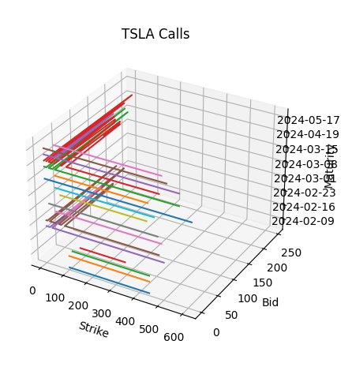

# Interactive 3D Options Graph

## Setup

The notebook uses these two external libraries, it is very important to have the last version of `yfinance`.

```bash
!pip install yfinance
```

```bash
!pip install ipywidgets
```

In some types of notebooks (like Colab) the `%matplotlib` widget can create headaches so it is better to just comment it like this:


## Problems

The program uses the current Bids to calculate the prices so if we execute the Notebook during non-trading hours we'll get no data about the price. In this cases, it can be noticed that almost all the bids are = 0.



## How to use it


